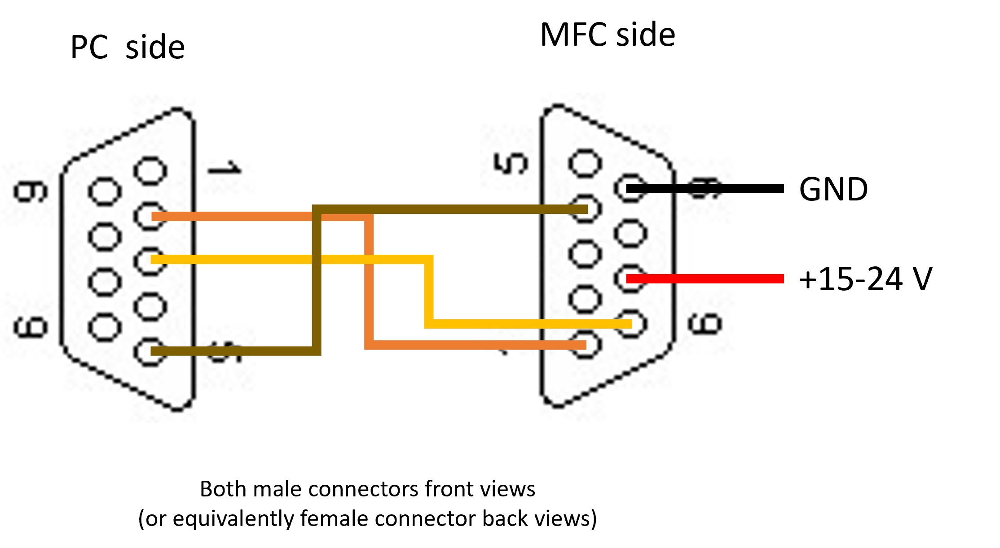

# Flow Controller

A python app to control Bronkhorst flow meters, using serial communication via PC

### Connection diagram
Refer to the following connection diagram to create the interface cable:

